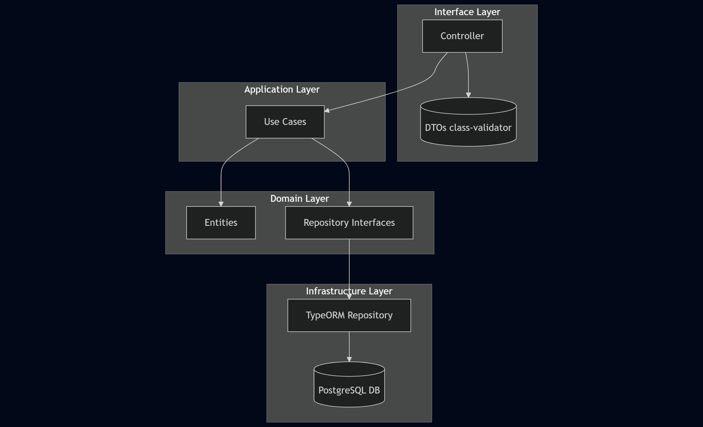
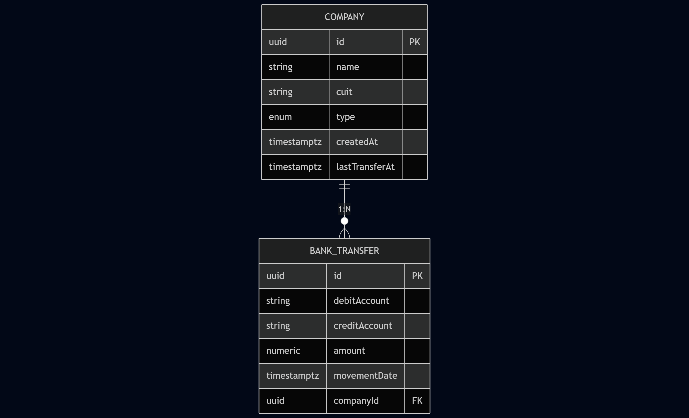

# Company Transfers API

API REST desarrollada con NestJS siguiendo principios de Clean Architecture, orientada a la gestión de empresas y el registro de transferencias bancarias, con foco en consistencia temporal (UTC), transacciones y buenas prácticas de diseño.

## 🚀 Tecnologías

- Node.js
- NestJS
- TypeScript
- PostgreSQL
- TypeORM
- Jest (tests unitarios)
- class-validator / class-transformer

## 🧱 Arquitectura

Descripción

La aplicación está diseñada siguiendo los principios de Clean Architecture, separando claramente las responsabilidades y evitando el acoplamiento entre el dominio y los detalles de infraestructura.

La arquitectura se organiza en las siguientes capas:

Domain
Contiene las entidades de negocio, value objects y contratos de repositorios.
No depende de frameworks ni de librerías externas.

Application
Define los casos de uso, orquestando la lógica de negocio y coordinando repositorios y transacciones.
Aquí se implementan reglas como crear una transferencia o buscar empresas del último mes.

Infrastructure
Implementaciones concretas de persistencia y servicios técnicos.
Incluye TypeORM, entidades de base de datos, repositorios concretos y el manejo de transacciones (Unit of Work).

Interface
Capa de entrada/salida HTTP.
Incluye controllers, DTOs de validación (class-validator) y filtros de excepciones para unificar las respuestas de error.

Esta separación permite:

Testear la lógica de negocio de forma aislada

Cambiar la base de datos o el framework sin afectar el dominio

Mantener un diseño claro y escalable

🗄️ Modelo de Datos

Descripción

El modelo de datos representa las entidades principales del sistema y sus relaciones, persistidas en PostgreSQL utilizando timestamptz para asegurar consistencia temporal en UTC.

Entidades principales

. Company
- id (UUID)
- name
- cuit (único)
- type (enum)
- createdAt
- lastTransferAt (nullable)

. BankTransfer
- id (UUID)
- companyId (FK)
- debitAccount
- creditAccount
- amount
- movementDate

Relación

Una Company puede tener muchas BankTransfer

Cada BankTransfer pertenece a una única Company

Decisiones de diseño

lastTransferAt es nullable para representar empresas sin transferencias

Las fechas se almacenan siempre en UTC

El CUIT actúa como identificador único de negocio

No se utilizan claves compuestas para simplificar integraciones y consultas

Este modelo permite consultas eficientes como:

Empresas creadas en los últimos 30 días

Empresas con transferencias recientes

Historial de transferencias por empresa

El proyecto sigue Clean Architecture, separando responsabilidades en capas claras:

src/
 ├─ application/      # Casos de uso y DTOs de aplicación
 ├─ domain/           # Entidades, repositorios (interfaces) y value objects
 ├─ infrastructure/  # TypeORM, repositorios concretos, DB
 └─ interface/        # Controllers HTTP, DTOs de entrada/salida, filtros

Capas

Domain: reglas de negocio puras (sin Nest, sin DB)

Application: orquesta casos de uso

Infrastructure: implementación técnica (TypeORM, PostgreSQL)

Interface: HTTP, validaciones y formato de respuestas

## 🕒 Manejo de fechas y zonas horarias

Todas las fechas se almacenan como UTC (timestamptz)

“Último mes” se define como últimos 30 días en UTC

No depende del país del servidor ni del cliente

Evita errores por DST o diferencias horarias

Ejemplo de cálculo:

const nowUtc = new Date();
const lastMonthUtc = new Date(
  nowUtc.getTime() - 30 * 24 * 60 * 60 * 1000
);

## 🔁 Transacciones (Unit of Work)

Se utiliza el patrón Unit of Work para asegurar atomicidad entre múltiples operaciones:

Registro de transferencia

Actualización de lastTransferAt en la empresa

Las transacciones se manejan en infraestructura, manteniendo el dominio desacoplado.

## 📦 Endpoints principales
Crear empresa
POST /companies

Body:

{
  "name": "ACME S.A.",
  "cuit": "30712345678",
  "type": "PYME"
}

Crear transferencia bancaria
POST /bank-transfers

Body:

{
  "companyId": "uuid",
  "debitAccount": "1234567890123456789012",
  "creditAccount": "9876543210987654321098",
  "amount": 1500.75,
  "movementDate": "2025-12-30T15:30:00.000Z"
}

Empresas con transferencias en el último mes
GET /companies/last-transfer

Empresas creadas en el último mes
GET /companies/last-adhesion

## ❗ Manejo de errores

La API devuelve errores consistentes y profesionales:

Validación (400)
{
  "statusCode": 400,
  "errors": {
    "type": ["must be one of the following values: PYME, CORPORATIVA"]
  }
}

Conflicto (409 – CUIT duplicado)
{
  "statusCode": 409,
  "message": "Company with this CUIT already exists."
}

Todos los errores HTTP y de base de datos se centralizan en un HttpExceptionFilter.

## 🧪 Tests

Tests unitarios para:

- Casos de uso
- Repositorios TypeORM
- Controllers

Uso de mocks y fakes para aislar dependencias
No se testea infraestructura dentro de application

Ejecutar tests:

npm run test

## ⚙️ Instalación y ejecución
npm install
npm run start:dev

Variables de entorno (ejemplo):

DB_HOST=localhost
DB_PORT=5432
DB_USER=postgres
DB_PASSWORD=postgres
DB_NAME=company_transfers

## 📌 Decisiones de diseño

CUIT es el identificador único de negocio

lastTransferAt puede ser null hasta que ocurra una transferencia

Fechas siempre en UTC

Dominio independiente de frameworks

Infraestructura responsable de errores técnicos
